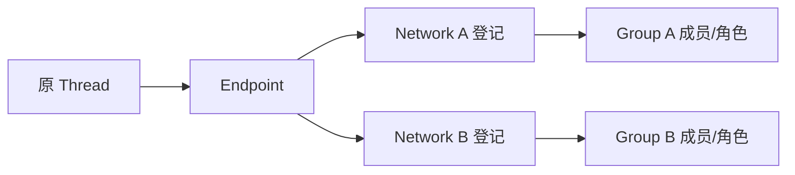

# Architecture v2.3 实施计划

## 当前执行：Architecture v2.3 全剩余闭环（2026-09-30）

本轮在 `dev` HEAD `f30892fcd79a27bfe5604575deaecebe52c5ec50` 的 M2 检查点上继续实现剩余目标；代码、源码身份与集中验收由根任务统一冻结。M1/M2 的既有结果仍只归属于其原始 fingerprint 和镜像。`docs/completion-ledger.md` 是 V01–V88/G1–G5 的逐项剩余账本；本文件提供五条路线和各自出口，不把未运行的设备、Runtime 或公网路径记为 PASS。

**本轮证据与出口（2026-09-30）：** `5414d6edee44e2be1cad04d10181fd1a23ccd3bf0004fa3fb7bb66776448de83` 的[后端门禁](../.cicada-data/architecture-wide-accepted-20260930T121202Z/gates-summary.json)为 1,307 Go PASS / 11 SKIP / 25 包、vet、13 项 race、八项 Python及三套 disposable real-TCP Docker PASS；同一 dirty source 与 Hub image `sha256:6a21824109c755cc47b345d0cd63b97c49b0d51306420c160ba4ab7b8aa9b475` 的[Chrome 151 browser gate](../.cicada-data/hub-web-panel-browser/20260930t131113z-251515-c3ac163f/result.json)在 loopback fixture PASS，`UNCERTAIN` 写故障注入和公网 HTTPS NOT_RUN。其后 `e13b3848…` 的[全 Go 门禁](../.cicada-data/architecture-wide-finalfix-20260930T123606Z/gates-summary.json)为 1,308 PASS / 11 SKIP / 25 包及 vet/Python PASS，但真实 CLI 0.159.2 在最终 route allowlist FAIL；`434c4eb6…` 的[原生重试](../.cicada-data/architecture-wide-nativefix-20260930T125600Z/gates-summary.json)因模型截短 synthetic Group ID 于首个 Join FAIL，未运行 ASK/REPLY。旧 backend/browser PASS 不转移给新源码。nested `group.create` 已改为 v41 单事务，隔离 checkout Store/Control 全包与定向 race PASS；M5 durable native-outcome 路径与 v41 同在主仓 [c33f… 有界检查点](v01-group-panel-checkpoint-validation.md)通过全 Go/race/迁移门禁；同源三套 Docker、Chrome 151 浏览器和受控真实 Codex 同 Group ASK/REPLY 也各有独立 PASS。下一波补齐 M3 即时引用/Network Task offer；Network offer 正文必须沿用端点密封语义，不以 Hub 明文“public offer”代替授权密文。当前 v0.1.x 不加入 OpenAI/dot/GPT-Live/ChatGPT plugin 功能或依赖；它们只列于 [v0.2.x 接入路线](v02-openai-integration-roadmap.md)。

1. **Group Space M3 cursor/unread**：Core、Hub Node HTTP、Node Unix bridge、MCP 与 SSE 使用同一当前 Guard。Sync 仅回传不含正文的序号/类别 hint，不隐式 mark-read，不唤醒模型；read-state 与单调显式 mark-read 单独授权。出口：跨 Group/越权/撤权拒绝、no-backfill、保留边界、掉线重连后重新对账、SSE 无敏感元数据，Node sync 不触发 native queue。
2. **Monitor M4 delegated regroup**：Monitor 仅提交 proposal；Owner 签精确 Network/Group/action/version/期限/nonce 委托后，Hub 执行一次性 CAS 并留下审计。出口：过期、撤权、重放、扩大读者、伪造 Owner、旧版本与并发写入全部拒绝；不复制历史 key、不自动批准跨 Owner board。
3. **M5 multi-Hub Node/Client fencing**：每个 Hub 使用独立注册、凭据、游标/replay 与授权；Node 对同一个原生 Session 仍只有一个有效 writer。旧测试只覆盖 origin/token pin 与本地 writer 串行化/epoch 审计；新 durable native-outcome 测试在 `c33f…` 有界门禁 PASS；完整两 Hub 服务仍未运行。出口：2 Hubs + 2 Nodes、两侧 Node 只出站；同 native message ID 碰撞、credential transplant、old-writer epoch 和 Control nil 均以真实服务路径拒绝/隔离，并证明无 Hub-to-Hub 转发。fake harness 不得冒充模型消费。
4. **Hub editable Web canvas**：新 UI 复用现有 Client v1.x 后量子加密 wire、`clientwire`/`e2ee`；Go WASM 小适配器加原生 SVG/DOM，无新 crypto。`5414…` 与 `c33f…` 各自的真实 Chrome 151 loopback gate 已通过加密 Owner pin/设备/vault/topology/status/canvas 正向链。Owner 写入继续走加密 Client 请求和服务端 Guard，布局不是授权。出口仍包括拒绝旧 bearer 写、拓扑 CAS/幂等/并发拖放、双 Owner Link 两侧确认、`UNCERTAIN` 故障恢复与公网 HTTPS；这些不由正向 Browser PASS 自动证明。
5. **Deployment + G1–G5 demo**：单个轻量 Hub Compose、不带 Codex 或模型/管理密钥；可选真实 Node agent 仅主动连 Hub，先打印短时设备码，由已认证 Client 预览并显式确认。出口：本地启动/health、持久 Hub state、Node 自有受限 state、重启不丢授权、Pin 过期/撤销失败关闭；串联现有 CLI/MCP 的明确 Join→Ask/Reply→历史/space→委托→多 Hub 选择路径。安装脚本不会 curl 未发布 artifact；部署和 native 模型验收由操作者显式执行。

共通不变量：不改独立 `CICADA_CLIENT` 仓库；v40 的新记录跨 Owner Group board 仅在精确双 Owner admission、join 与 key proof 下工作，跨 Owner 历史继续拒绝；不弱化密码终点、不让设备码取代登录授权；不把“入队”报告成“消费”；不更新 resident/global CLI；不替换常驻服务、不清理旧 state。一次性开发 Hub 与现有数据目录分开，迁移始终增量且可审计。

## 历史检查点：M2 Group Journal / Discussion（2026-09-30）

以下 M2 说明保留原验收范围和证据；文档中“本轮不实施 M3–M5/UI”的句子只属于此历史切片，已由上方全剩余授权取代。

## M1 候选与历史门禁（2026-09-28，以下为当时快照）

**当前 M1 后端矩阵 PASS（2026-09-28）。** Hub schema v36 与独立 `client-hub-v1.4` 合同（encrypted wire v1、36 项操作）已接入：Owner 设备可在 `topology.snapshot` 查看有界 Network/Endpoint 拓扑，`topology.apply` 的 `group.create` action 在 ACTIVE Hub 显式选择同网 Network；Network-only Endpoint 可发布独立密钥候选，经 Owner 签当前 manifest 后使用 Network scope 的密封 SEND/ASK/REPLY，不需伪 Group 或共享原生 writer。Node/Relay 与 Client 管理信道保持分离，capability 不代替逐请求授权。冻结源码 fingerprint `479386745593bf9dee679513cb2038cff08530abcc65fab1482736c4d837e3fe` 前后不变：全 Go 25 包、vet、16 个聚焦 race 用例、合同与八项 Python、默认 Client 和 Network 两套独立 disposable real-TCP Docker 门禁均 PASS；结果属于 HEAD `733ca86` **加 dirty 工作树**，不能只归因于 HEAD。Android、真实 native Runtime、双物理 Node、公网 HTTPS仍 **NOT_RUN**。见 [门禁记录](../.cicada-data/m1-final-20260928/accepted/go-gates.json)、[Client 结果](../.cicada-data/m1-final-20260928/accepted/client-docker/result.json)、[Network 结果](../.cicada-data/m1-final-20260928/accepted/network-docker/result.json)、[M1 验收矩阵](network-m1-validation.md)和[公开合同](client-hub-wire-v1.md)。

**历史有界检查点（2026-09-28）：ACTIVE Network 授权与迁移加固 PASS，仅归属当时源码。** 已实现目录 AccessScope 与可见卡同一 Store 事务核验、Request 状态/取消及旧消息 enrollment revision 复验、Task/Handoff 读取时的 native Actor 守卫和写入时的当前 Network/Node 守卫、Task 验收时的精确 Actor 复验、Artifact 元数据/列表的 Endpoint 级读取守卫，以及 Group key proof 在映射、Network 撤权和 Endpoint leave 后的签名 revision fence。旧 Group/Endpoint 关系、Grant、原生 writer 与其他 Network 授权不随这些 fence 自动变更；PREPARING 中仍未映射的旧 Group 保留旧行为。已补跨 Store 撤权、旧已接受和未接受 proof、fresh consent、Task/Request 与 Artifact 负例，以及 v34 升级保全和中断回滚的合成检查。当时整仓 Go、vet、聚焦 Network/ACTIVE 四包 race、合同及八项 Python 检查、默认 Client 与 Network 两个 Docker 门禁均 PASS；测试前后源码 fingerprint 同为 `1738095ea36e47655808857ce1934a72241bab1d8bb860d62f24299964c38d00`。该结果归属 `HEAD 975ce8e` 加当时未提交工作树，不能单独归因于该 commit，也不是当前 v1.4/v36 候选的最终门禁；整体 M1 当时仍未完成。

**当时轮次停止于 M1 后端验收，未启动 M2。** Network-only 密封 E2EE 私聊、ACTIVE v1.4 Owner 拓扑/同网建组、迁移保全与各入口 Guard/撤权矩阵已进入上述后端确定性与一次性 Hub HTTP 门禁。该 PASS 不外推至真实原生 Runtime、Android、双物理 Node 或公网 HTTPS；它们各自仍是 **NOT_RUN**。M2 Journal/Discussion 仅作为下一阶段目标。

M1 接口按独立组件组合：原 Thread 经已验证 Node 注册 Endpoint；Endpoint 可分别加入多个 Network；Group 只归属一个 Network，成员和角色在该 Group 内另行授权。HTTP/MCP/CLI 选择同一个已登记 scope 并复用核心 Guard；选择器不创建权限，不将 Network 伪装成 Group，不另起 Agent 或模型服务。错误与结果按各自授权边界稳定返回。

**M1 后的面板阶段（本轮不实施）：** Hub 自带受认证、分权的 Web 面板以无限画布操作 Endpoint、Group、连线与可选 Monitor。先复用 M1 的 Owner Network 选择、拓扑读取、同网建组与精确授权原语；后续另定小批量、带版本的 Control action 合同，供框选/拖拽/连线预览影响后原子提交。布局数据不成为权限源；跨用户连线需双方授权，同一 Endpoint 在多 Group 只是引用，跨 Hub 通信须显式选择共同权威 Hub。此仓库拥有 Hub 附带面板及其后端；独立 CICADA_CLIENT 仓库拥有 Android 原生或嵌入界面。面板服务端不持有 Node peer 私钥或生成 Owner 批准证明，普通消息仍走 Node E2EE/Relay。此项是 M1 验收后的阶段目标，不增加本轮服务、依赖或 Android 改动。

**历史重大检查点：PASS（仅限固定 v1.3 候选）。** Clean Hub source `25013b51915124fa1da25e5fd37088eadf0e3d2d` and image `sha256:a1cf39e4b341cda7d5f80a13b8c3272964f43e5341eadbae1b6caafb6a68a31c` passed full Go tests, vet, focused race, contract/export/verify and exact-image disposable TCP gates. The fixed native runner `0d532f2e3bb57a9c82df4967044e4f40861c45a6` reports one read-only preview, one separate dispatch and successful receive/context assertions in both original recipient Threads. Client reported all 10 selectors and the final strict read-only status pass; the Core scoped ciphertext scan and Intake's independent Hub-state audit passed; Android/native fixture and emulator cleanup exited `0`, with no owned containers or fixture directory remaining. These results remain attributed to those pinned identities; evidence is in the [25013b5 candidate record](client-hub-v13-25013b5-validation.md), [native runbook](client-monitor-native-fixture.md), and [Client's final validation](../../CICADA_CLIENT/docs/client-monitor-v13-25013b5-native-validation.md).

The `0cda61460757246789970782584b1e904173e653` clean `dev` base was the M1 starting point. Relative to `25013b5`, its changes under `cicada-go` and `scripts` were limited to `monitor_broadcast_android_native_test.go` and the fixed native fixture runner; the application implementation was unchanged. The prior Go/vet/focused-race/TCP and native evidence serves as a baseline only, not as M1 acceptance. That baseline's Node-local read-only preview is bound to the original confirmed approval; its deterministic tests prove review does not mutate approval/replay/outcome state or create an outbox, and that stale or mismatched authorization fails closed. See [Monitor preview and approval evidence](monitor-broadcast-approval-review.md).

**历史 M1 foundation 阶段：Network identity、Guard、迁移与既有入口收口。** `b0081a0` 的限定 Network foundation checkpoint 已通过分离的 Network 与默认 Client Docker 门禁、focused race、full vet、冻结合同及七项 Python 检查。初次整仓 Go 测试仅因旧 migration test 的 v34 ledger 期望失败；`f9d3c7e` 只修正该断言，随后完整 Store suite 通过，其余包在初次运行已通过。该时点整体 M1 仍 **NOT_COMPLETE**，详见[验收矩阵](network-m1-validation.md)和[操作合同](network-m1-contract.md)。当时 Network-only 无 Group Endpoint 不能私聊；不同 Group 的双方可各凭本 Network 的有效 Group 与双边 Owner Link 授权使用既有密封私聊。冻结 Client v1.3 `group.create` 无 Network selector，在 ACTIVE Hub 被拒；默认 PREPARING Client 门禁不能证明 ACTIVE 兼容。当时 M1 native Runtime、Android、双物理 Node 与公网 HTTPS 均 **NOT_RUN**。当时计划先补足 M1 入口和验收缺口，再推进 M2；native TUI adapter 可行性仅作下一项有界调查。本轮不实施 M2 Journal/Discussion、M3 授权路由/未读、M4 委托再分组、M5 多 Hub，也不修改独立 Client。此前 `81d8f1f` 自动审查拒绝保留为历史，不影响当前 M1 授权。

任意授权 Thread 对默认通过 HubRelay 传递密文。M1 后的下一项 adapter 检查仅考虑一项 direct 例外：两个目标 Thread 必须位于同一物理宿主机、同一 Codex 账号，且 Node 能调用可用 native API 精确触达目标；相同 Hub/Network/Node label 均不够。direct 只替代传输，Nickname/Endpoint 必须先解析为唯一 Thread，Network/Group/Link/SessionBinding Guard 仍独立执行。工具在模型会话中可见，不代表 Go Node 获得了可独立调用的 API；可用性通过前保持 HubRelay 默认。现有同 Node 密封路径已把正文留在 Node 本地账本/队列，授权 metadata 仍可经 Hub Guard；通用 TUI 直连适配器尚未实现，Node 也不会因此自动发现或 Join 账号下所有 Thread。详见[本机原生直连可行性](native-local-direct-design.md)。

## Agent Network 与 Group collaboration spaces 路线（M1–M5）

Network 是 Group 之上的私有 tenant/授权范围，不改变 Node/Hub/Client 部署实体，也不增加 User/Control/Worker/Monitor 之外的参与者。一个 Hub 可托管多个 Network；每个 Network 只由一个权威 Hub 承载。编号使用 M1–M5，避免与 `docs/client-hub-development.md` 的 N1–N6 冲突。

**2026-09-28 当时执行 M1。** 新增 Network Owner 操作已放入独立 `client-hub-v1.4` 候选，不回填冻结的 v1.3 catalog/image；encrypted wire 仍为 v1，新合同与 Hub 实现、公开向量和检查同批验收。M2–M5 仍按下表依赖推进，不为每个阶段额外设立普遍审批门槛。

| 阶段 | 最小交付与验收 | 依赖 / 明确不做 |
|---|---|---|
| M1 — Network identity, migration, Guard and discovery | 一个 Hub 托管至少两个 Network；Group 各属一个 Network；版本化 NetworkMembership、scoped grants、邀请/策略加入、Thread owner 确认、最小 EndpointCard 和少量权限预设；migration dry-run | Network/Group isolation、撤权、歧义昵称、旧入口绕过拒绝；保留现有 ID、历史、授权边界。暂不做 Board 和多 Hub 路由。 |
| M2 — Encrypted Group Journal and Discussion | Journal append/list/get；Discussion topic/reply/list/get；来源归属、幂等 ID、有限 cursor 分页、Evidence 独立 ACL、`read_from_seq` 与保留策略 | 先审定逐读者封装或群内容密钥方案；Endpoint key grant 不是共享内容密钥。新成员只从加入 cutoff 读；既有授权成员离线补读时仍逐页查 Guard；更早历史另行授权。限制正文/读者/分页/保留/hint queue。 |
| M3 — Links, task/broadcast routes and unread sync | 在一个权威 Hub 作用域内将选定 Journal/topic 引用带入立即消息；连接既有获准私聊、Network Task offer 和逐收件人广播；复用 Node→Hub 出站长连接多路复用 cursor hint；Endpoint 分页拉取并维护本地未读 | 同 Network/Link/Group 规则逐资源 Guard；Journal/Discussion hints 不推正文、不唤醒所有 Model；即时消息保留自身投递语义；重连按 cursor 补读，周期对账低频退避。跨 Hub 路由不在本阶段。 |
| M4 — Delegated topology and regrouping | Monitor 先提出二次分组；仅在精确、可撤销 delegation 下按拓扑版本 CAS 执行并审计 | 无自授权、无隐式历史 key/读者扩张、无自动 Thread/context 迁移；扩大可见性走现有 Owner/User Approval。 |
| M5 — Multi-Hub Node and Client interop | Node 按 Hub 隔离 credential、Endpoint registration、订阅、序号和 replay 状态；地址为 `(hub_id, network_id, endpoint_id)`；同一 native Thread 仍由一个本地 writer 仲裁。未来 Client 独立合同、每 Hub identity pin/device key/session/counter，明确 active Hub/Network | 依赖 M1–M4 已稳定 scope/Guard/route。禁止 Hub-to-Hub forwarding 和公开全局 Thread ID；Client 由其仓库 Owner 实现，不修改或回填冻结的 v1.3。 |

M1 的首个可运行验收切片必须包含：同 Hub 双 Network 的数据/授权隔离；每 Network 最小成员邀请和 Thread owner Join；默认权限预设与按资源 scope 的 Guard；最小授权目录/私聊；撤权、scope 伪造、昵称歧义、NetworkAdmin 越权和旧 API 绕过拒绝；用户可读的拓扑/发现结果；schema migration 预演、回滚边界、全 Go 和 disposable Docker 门禁。Network membership 本身不赋予共同 Group 权限；Network-scoped directory/direct-message/task grants 可在没有共同 Group 时工作，但不能泄露私有 Group、历史或未分享 Artifact。这是 M1 时点的原计划：当时 M2–M4 均为提案；现在 M2 有 [实现合同](group-spaces-m2-contract.md)，M3 cursor/unread 与 M4 精确委托已有确定性后端覆盖，而 M3 引用/Network Task offer、真实产品流程仍未闭环。M5 保留跨 Hub Node 和独立 Client 多 Hub 范围。

旧Group到Network的映射不得按Owner机械拆开（可能破坏已有跨Owner共同Group/Link），也不得为了保留连通而合成一个大Network。迁移输入必须显式列出旧Group→Network；缺失、多解或会扩大已有可见性的映射停在pending供用户确认。保留Endpoint/Group/Link ID、Thread、receipt、密钥、审批和旧Grant历史；按新scope逐项验证现有精确授权，覆盖不足时双方重新授权，不自动重信任或复制旧Group key。NetworkAdmin仅有该Network的管理grant，不持有Node命令执行、成员设备/私钥、原生历史或用户审批权。

所有阶段保留Go、SQLite、单二进制/既有Docker，不预建消息中间件或全局管理服务。目录发现、私聊发送/接收、广播、Task offer分别授权；默认显示最小卡片，不保证匿名，路由所需Hub/Network元数据、成员存在与流量时序仍需最小保留。提示词不是prompt-injection防御。每个真实/确定性/Android/native/双物理Node/public HTTPS结果单独分层记录；skip不算pass。

## 历史实施记录（以下日期快照不代表当前状态）
> 2026-09-27: earlier clean lease-fix candidate `81d8f1f` deterministic checks, full Go suite/vet and exact-image disposable TCP interop **PASS**. Its native attempts and bounds are recorded in [the historical candidate report](client-hub-v13-81d8f1f-validation.md); they do not describe the current 25013b5 live run.

> 2026-09-27: frozen v1.3 artifact and disposable TCP gate **PASS**; exact pins and
> evidence are in [the validation record](client-hub-v13-validation.md). The dated plan below is a pre-freeze snapshot.
> Earlier standalone three-Thread native Monitor acceptance **PASS** used an in-process Hub and synthetic Go client; see the [native validation report](architecture-v2-native-validation.md). The frozen fixed-Hub v1.3 outer-RPC recovery slice also **PASS** (three fresh Hubs, 12/12 Android JUnit selectors); see the [validation record](client-hub-v13-validation.md). Neither result validates the current 25013b5 native attempt. The Client-reported limited Android emulator **PASS** has completed Core read-only code/evidence review. The synthetic-endpoint run has an empty recipient ledger and does not establish recipient delivery/model consumption. Physical Android, dual-physical Node and public HTTPS remain **NOT_RUN**; unattended cold wake is **UNSUPPORTED**. See [the Client evidence and boundaries](client-hub-v13-validation.md#client-reported-android-emulator-slice-core-review-complete).

## 2026-09-27 Historical lease-fix candidate checkpoint: 81d8f1f

The earlier fixed runner pinned clean Hub source `81d8f1f90895f41c4f5ea5c67a6281ccda9e1264`
and image `sha256:0c484d1c10a9fd71e6ae74ddd7fec85ae6ae8cbecf2ece6f90d393892990a04f`.
The two attempts on that image did not complete the three-Thread chain. This historical
candidate is superseded for the current fixture by 25013b5; its deterministic PASS
does not transfer a native PASS. Current pins and outcomes are in the
[25013b5 validation report](client-hub-v13-25013b5-validation.md).

## 2026-09-27 截至冻结前的候选执行顺序快照：完成 v1.3 候选门禁后再做 Android

Hub v34 已为 Client Monitor consent 元数据、有限 preview intake 与有界通知扫描
接线。限额定向 Store 测试、Client catalog 检查与七项合同/恢复 Python 测试通过；
两个定向 TCP Monitor HTTP lifecycle/Relay 测试也通过。Confirm response projection
与 OpenAPI 不匹配及 inactive Group 拒绝缺口已修正。整仓 Go tests/vet 原先通过；
随后受影响的 Control/Server 全包测试、vet、聚焦 race 及 Store race 复验均通过。截至
冻结前，只待干净 artifact 元数据与最终 disposable Docker Hub gate。候选目录为
`client-hub-v1.3` / 33 operations；这不是 Android 联合验收或发布结论。详见
[当前状态](architecture-v2-status.md)。

1. **完成。** v34 migration 与数据保全、intake 上限
   16/Device、64/Owner 和每次至多 16 个通知候选。五分钟 expiry 是硬边界；
   精确 Prepare 重试不额外占容量。旧 v1.2.1 Android PASS 与干净 `f1b99c4`
   idle-Hub 数据继续只归因于原固定源码/镜像，不作为本轮产物证据。
2. **截至冻结前进行中。** 由根任务生成干净来源的协议包与 Hub 镜像元数据并通过最终
   disposable Docker 门禁。不要用
   dirty 工作树、catalog 单独摘要或共享开发 Hub 替代精确交付元数据。
3. **截至冻结前待开始。** 收到准确 commit、bundle manifest/hash 与 image ID/digest 后，才让
   独立 Client 导入候选并做 Android preview/confirm/recovery。新 Android、真实
   native Monitor、前台交接、双物理 Node 和公网 HTTPS 仍分别验收；当前均
   **NOT_RUN**（均为截至冻结前的记录）。

独立 Client 仓库的双 Owner 合成授权任务已完成：实现 `680fac2bf12c431ac02804e5db168669cf12941f`、
报告 `a4007a51b53a36b15ecc02cbf50bdac4f744ec56`，固定旧 `967dbd8` Hub，
Android 合成 Endpoint 授权/撤销 PASS；没有 Codex/native Thread 或 Monitor 广播。
这是 v1.2.1 镜像的历史验收，只证明该次限定范围；不能认证当前 v1.3 候选，也不改变
V73 仍需真实 native Monitor/Android 验收的 PARTIAL 结论。

## 2026-09-26 并行实施与后续接线

本轮分为三个不重叠实现范围：Store v31 用户/Monitor 授权状态机、复用现有
NIST 原语的 Client→Monitor 密封格式、旧 Federation 明文写入口退役；主线程
补 Node 广播子投递的快照校验并集成回归。具体运行证据记入状态文档。

下一切片按依赖接线，不提前开放半成品 Client 能力：

1. 将独立授权账本接入 Control 的可信 Client 请求上下文；固定预览/确认/
   状态查询 DTO，过滤 native Session 信息，补契约与完整跨语言合成向量。
2. 实现 Node 只出站领取 Monitor 管理请求与持久分层回执；Monitor 当前原生
   会话经 MCP 消费批准 ID，由 Node 解密正文并校验实际摘要，再调用已加固
   的逐接收者密文发送。授权预留不等于 Runtime 消费或全员收到。
3. 完成授权撤销、过期、丢响应、Node 重启、部分失败与 Control 隔离测试后，
   才提高 Client 合同修订并交付固定包/镜像；直接协调既有 Client Thread
   `01a0cc3a-91d2-74f2-9f41-547c9b38fb0d` 独立接入、验收并回报。

本节记录基础提交时的接线缺口；最新执行顺序见顶部。V73 尚未完成 Android/
真实原生 Monitor 全链，既有 v1.2.1 Client 无需因内部实现而更换固定包。

接线审查确认以下具体约束：

- Client 入口只能使用 `client_rpc_v2.go` 验签、解密和持久接受后传下来的
  `accepted.Request.ID`。正文内不得接受请求来源、角色或批准者字段；Store
  的内部输入结构不能直接复用为 Client JSON。
- 需要新增专用 Node 响应，在同一次当前授权检查内返回数据库确定的
  `MonitorBroadcastContext`、Client 公钥、密文和固定快照。现在 Store 返回
  类型的部分字段不参与 JSON，且缺少上述完整上下文，不能直接作为 Node
  HTTP 返回值。Client DTO 则应排除 native Session ID 与 Node 私有定位信息。
- 现有 Worker job 会启动受管理 Worker，不适合投递给原来的 Monitor Thread。
  新管理请求需独立 claim/回执，复用 Node `nodeinbox` 的注入日志和不确定状态，
  由出站 SSE 提示及重连/定期对账领取；不得只改 SSE 后丢掉离线持久恢复。
- MCP 广播 outbox 当前会生成新 operation ID；批准广播必须使用账本预留的
  `bc_…` / `op_…` 同一身份，以同一批准重试，不另发一笔广播。普通广播不能
  因参数中写了批准 ID 就取得用户来源。
- 当前五分钟 TTL 同时是硬派发期限：过期后连同原操作重试都拒绝。后续状态
  DTO 应明确展示过期，不能把它描述成任意时长离线可送达；若需要延长期限，
  必须进入用户签名与批准范围。逐收件者持久回执完成前也不能汇报全员成功。

## 2026-09-25 收尾与下个安全门槛

当前 `dev` 在干净 `d88e090` 上通过整仓 Go 测试/vet、合同校验、一次性
Client–Hub TCP 联调与双私有网桥拓扑门禁。sealed Link ASK 的真实 TLS/SSE
断流恢复已与 Node 生产 claim/decrypt 接成一条 deterministic 测试，Runtime
仍是假队列。同 Group 三真实 Codex Thread 广播夹具已加入，但第三次独立
opt-in 在首个 Join 因 Codex 自动审批超时结束；V72 保持 PARTIAL，不能据前两轮
部分阶段宣布原生广播通过。详见[状态矩阵](architecture-v2-status.md)与
[原生验收记录](architecture-v2-native-validation.md)。

下一条可执行的工程切片应先取得受支持的 native Session ID 来源和前台所有权/
安全注入回执，或明确使用需用户在前台交接的模式；在缺少该协议前不实现
无人值守 cold resume。用户经 Monitor 广播需要独立的可信 Client 操作、
与正文/Group/Monitor/版本绑定的用户批准记录及 Guard，不能借用普通
`intent.submit` 或 Worker `approvals.decide` 伪造批准。该功能应作为新的
合同修订与 Client 仓库协同交付；保持现有 v1.2.1 固定镜像可复验，
不将它悄悄扩展成不受审的 Monitor 广播入口。

V73 的完整端到端验收仍为 **NOT_RUN**；以下为 9 月 25 日确定的实施依赖，
内部基础进展见本文件顶部与状态矩阵：

1. 固定新 Client 合同修订（外层 PQ wire framing 可保持 v1），至少提供
   `group.broadcast.preview`、`confirm`、`status`。预览绑定精确 Group、当前
   Monitor Endpoint/角色/SessionBinding、正文 SHA-256、收件者快照及期限。
   Client 本地显示并确认最终正文，将它密封给已验签的 Monitor Endpoint；
   Hub 的批准账本只保存摘要、路由和密封正文，不记录可读广播正文。
   `status` 供响应丢失、
   `OUTCOME_UNCERTAIN` 与逐收件者结果查询，不能因恢复通知重建一笔广播。
2. Control 在 owner/device-bound Client 会话中写入版本化用户发起与批准记录，
   并创建独立的 durable Monitor 管理请求。Monitor 角色不能仅凭普通
   `message.broadcast` 权限推断；管理请求离线排队、重放幂等，Node 领取和
   原生 queue 的不确定窗口按现有分层回执处理。
3. Monitor 原生 Thread 在当前 Session 下实际调用扩展的 MCP 广播，Node/Hub
   核验批准 ID、正文摘要、Group/收件快照、角色、binding epoch、期限与单次
   使用；Monitor Node 解开给自己的密封正文，然后复用现有逐人 sealed SEND。
   Sender 仍是 Monitor Endpoint，
   用户只作为可审计 origin/approver；Hub 不得冒用 Monitor Session。
4. 同仓完成 catalog/OpenAPI/wire 文档和拒绝测试，再让 Client 独立导入新包并
   做 Android 预览/确认/丢响应恢复测试。验收必须覆盖伪造批准、错组/错
   Monitor、撤权、成员变化、重复确认、离线 Monitor、单接收者失败和限额。
   现有 v1.2.1 固定镜像仍以旧合同单独复验，不将新增能力回填旧镜像。

## 2026-09-25 当前执行切片

本轮从干净的 `dev` / `967dbd8` 开始，不扩大 Client 协议或产品范围。先以既有
Codex 适配器、CIRCL、SQLite 账本与 Node 出站连接为基线，分别完成：

1. 两个独立 owner、两个逻辑 Node 的真实 Codex 原生 Ask/Reply 验收；逐端核对
   Join 前、注入后和 Reply 后的 native Thread ID，并记录 Hub 只见密文、
   Control 业务调用为零。测试驱动显式恢复与无人值守冷 Thread 唤醒分别记录，
   不把 `codex queue` 的成功退出当成后者通过。若模型或适配器能力不足，保留
   可复跑测试并明确阻塞。
2. 修复一个具体的 Node 重启/对账故障窗口，用确定性故障测试证明状态与重试
   语义，不把传输去重写成模型或外部副作用的 exactly-once。
3. 核对官方 Codex 与现有开源密码/存储组件的可复用能力，记录版本、许可证
   和不引入额外运行时的理由；据此确定冷 Thread 的显式 resume/安全点能力
   门槛；固定来源和取舍见[开源复用审查](architecture-v2-open-source-review.md)。
   再跑完整 Go、合同与隔离 Docker 回归。

每项只在有实际代码和测试证据后更新状态矩阵。当前片段不代表 v2-A/B/C
整体完成；双物理 Node、真实 Android 和公网 HTTPS 仍须分别验收。

本切片实际结果以[状态矩阵](architecture-v2-status.md)和
[原生验收记录](architecture-v2-native-validation.md)为准：Relay attempt fencing、
Codex queue 分层回执、次要 Group sealed claim 与一次性 Docker 出站拓扑门禁已
实现并通过确定性测试。跨 owner TestMCPSealedCrossOwnerCommunicationLinkAskReplyNative
现已在同机两个逻辑 Node、两个 owner 的真实 Codex Thread 上通过，A/B 原 ID 保持，
Hub 不见正文且 Control business call 为 0；早先两次未走到 B Join 的失败运行保留为
历史诊断，不再代表当前状态。测试 driver 使用受控 codex exec resume；
Codex 0.157.0 的 MCP ID 与前台 owner/epoch 协议门槛未满足，生产无人值守
cold Thread wake 暂标 **UNSUPPORTED**（证据见原生验收记录）。Client 在另一个仓库对干净的
`967dbd8` / `client-hub-v1.2.1` 固定镜像完成 Android 模拟器的管理链路验收；
随后用[可复跑夹具](client-group-key-disposable-fixture.md)、真实 Node/Codex leased
Endpoint 与最终 Android APK 完成独立 Group key 正向 Grant、`CURRENT`、`STALE`
和 `PROOF_EXPIRED` 验收，见独立仓库的固定镜像报告。该夹具准备本身不算验收；
它的 Node Join Unix socket 路径问题已在核心脚本中修正并通过启动/清理 smoke。
Client 的历史固定镜像验收不得替代当前 dev Go 代码或新 dirty 镜像的验收。

## 前一切片：两仓接口与联调规范化

此前按 [联合开发规范](client-hub-development.md)
的 N1→N2→N3 完成统一 operation catalog、可追溯轻量 Docker Hub、协议包、
公开合成 wire 向量与 CI。保持两个仓库独立，不修改 CICADA_CLIENT，也不
把该规范化切片描述为 Architecture v2 全部完成。

N4 的 Hub 设备登记精确重试、RPC 恢复查询与 `OUTCOME_UNCERTAIN` 故障窗
已实现并通过 Store/HTTP/一次性 Docker Hub 测试；Client 已在固定干净
`967dbd8` 镜像上通过 Android 模拟器的丢响应恢复和三类故障结果。
v1.2.1 校正 Endpoint attestation 的跨仓签名原文合同，
保留既有证明与 Grant，不重写密钥或计数。N5 的 Hub `goal.result` owner-scoped 结果读取已实现；
隔离 Hub HTTP、真实 Node Agent、真实 Codex 与加密合成 Client 协议驱动已完成
Worker→审批→结果闭环；Client 又在 Android 模拟器上对同一固定镜像完成
发起/批准/读取结果验收。下一步先验收
真实 Node/Codex 冷 Thread 唤醒与身份连续、Node 恢复后重新联网对账及双物理机
封闭路径；Client 真机、公网 HTTPS 和发布属于后续 N6。恢复必须保留设备
身份、旧结果、重放水位和授权，不盲目重试副作用。

2026-09-24 执行更新：同 Group 广播已从纯设计进入代码验证。当前切片先以 Hub v28 固定同 owner、同一精确 Group 的不可变成员快照，再由来源 Node 分批使用现有本地/跨 Node sealed `SEND`，每名收件人有独立密文、稳定子操作 ID 与进度记录；MCP 暴露 `cicada_broadcast`。此切片只允许当前加入且同时具备 `message.broadcast` 与 `message.send` 的 Agent 发起，目标须有 `message.receive`，上限 32 人、每批 8 人。`UNKNOWN` 需要显式 `cicada_operation_retry`，不会把传输持久接受误报为模型消费。后续仍需证明真实 native 广播、用户经 Monitor 的可信发起/批准、跨 owner 广播与 Node 恢复后对账。以下较早的“广播关闭”叙述记录的是本切片之前的状态；以本段和 [状态矩阵](architecture-v2-status.md) 的最新验收为准。

2026-09-24 复核。目标以 [CICADA.md](../CICADA.md) 为准，现状与证据见 [audit](architecture-v2-audit.md)、[status](architecture-v2-status.md)。本计划不把旧 MA→MB 联邦路径改名当作新跨组能力，也不以新增 `Group` 字段代替身份/授权迁移。

## 目标与顺序

部署顶层固定为 **Node / Hub / Client**；协作参与者固定为 **User / Control / Worker / Monitor**（Monitor 可选）。Node 本机通信不经中心 Relay；跨 Node/跨用户通过双方都主动连接的**一个** Hub Relay。Hub 可以组合部署 Control、Directory、Relay 和面板，但普通 peer 明文与解密私钥不得进入 Hub。一个 Thread/Endpoint 可以加入多个可嵌套 Group；跨组/跨用户消息按显式、双端授权的 CommunicationLink 直达，不默认经 Monitor。组内广播是按固定成员快照的独立操作。

以下按依赖顺序逐步交付。每步都先补负面/故障测试，再把新入口向 MCP/HTTP/CLI 和面板开放；跨步状态不得用目标设计冒充当前能力。

### 1. 固定协议与数据迁移

1. 当前 v11 已新增 Endpoint-Group 多对多关系和精确回填，MCP/HTTP/CLI 的显式 Join/Leave/作用域及 Directory/Relay 授权已接入；同机双容器真实原生多组验收已通过。v12 增量实现了 Group parent 的版本化管理、防环和不继承权限。v13 增量保存不可路由的同 owner CommunicationLink 提案及版本化撤销。v14 只新增按 Group 可读的 `CANDIDATE` 公钥登记；MCP 已可从显式 Join 的当前原生 Session 发布其 Node 本地公钥候选。v15/v16 将用户独立持有的公钥经 Hub 本地离线信任流程登记，并保存 Link 两侧精确合同的 ML-DSA Grant；两端当前原生绑定/成员版本与 key 状态在读取时重查。v17 最初只增加 Relay 密文 BLOB 与明文读路径隔离；v18 增加单 owner Client↔Control PQ 设备登记、重放保护、加密 RPC 与状态快照；v19 增加持久异步 Intent 与恢复；v20 增加 owner 确认的 Node 设备码绑定；v21 增加部分状态快照差异游标。v22 将当前合同、两端原生绑定和公钥候选组成可复核清单，并用 Client 加密 RPC 保存两侧密钥绑定签署；旧 v16 合同 Grant 仅为历史。v23 让 Client 新建的 Node/Goal/Intent 保留 owner 并收敛 Worker 领取凭据；v24 对远端未领取 Goal 提供真实的版本化暂停/恢复；v25 扩展状态差异游标的审批与 Intent 元数据。v26 为分别登记的两个 owner 提供一次性外部邀请、预览和接受，接受仅产生 `PROPOSED` Link；外部 Client 的设备/Node/邀请/本侧密钥同意操作与管家管理范围分离。v27 增量保存同 owner、当前 Group/Endpoint/SessionBinding/候选公钥的签名授权，并通过加密 Client RPC 提供授权预览/接受；本轮又接通 Node 独立验签、Hub Node-only 密文 SEND/ASK/REPLY/claim、注入前授权复查和同组跨 Node 路由。Store 全包、Hub HTTP 集成与两逻辑 Node/fake Codex same-Group full-chain 测试已通过。旧 `/v1/fabric/*`、Thread queue/message、Contact peer ingress、SSH machine pair 和明文 token 下发已退役。双 owner 显式 Link 与同 owner 同组均有逻辑 Node/fake Codex 覆盖；同 Node sealed 路径有 fake 全链/故障测试及一个 Node 上两真实 Thread 的 Codex Ask/Reply 验收。同组跨 Node 与跨 owner Link 的真实 Codex Ask/Reply 也已在同机两个逻辑 Node 上通过。双物理 Node、无人值守 cold wake 和 Node 一致点恢复后对账尚未验收。保留旧 Endpoint ID、原生 Session、单 `group_id` 列为迁移投影；不自动把旧 Session 放入宽权限全局 Group。
2. 明确每条消息使用的来源 Group、目标 Group、link revision、双方 Principal/Endpoint 及可信 SessionBinding；若多条连线或 Group scope 均可匹配，返回歧义，不依赖模型猜测。父子 Group 关系不传递访问权。
3. 迁移前后用 `migration inventory/backup/verify/restore` 在合成 StateDir 检查旧 Goal、Contact、消息、Approval、密钥/重放计数；真实 StateDir 仅在用户授权的运行环境与维护窗口操作。旧 GroupGateway 请求保持只读可追溯，完成映射前不删除表。

退出条件：同一 native Session 重复 Join 两组仍是一个 Endpoint/SessionBinding；每组可独立退出/撤权；未 Join、伪造身份、旧接口绕过和越权枚举均拒绝；数据库中旧 ID/密钥/计数未丢。

### 2. 打通本地与单 Hub 传输

1. Node-local `CryptoState` 已有 durable sequence、精确密文 outbox；Node DB v3 对新收件将经认证的密文和 replay 同事务保存，旧 replay-only 行明确要求对账。v4/v5 扩展跨组 pin 的签署清单和独立 Owner key trust；Node 能核验双侧授权证据并持久 pin，但该 pin 不赋予消息路由权。跨 Node 显式 Link 密文 SEND/ASK/REPLY 已把 outbox、Relay receipt、目标 crypto inbox 和原生 queue 接通。同 owner、同 Node、同 Group sealed SEND/ASK/REPLY 已由可信适配器写入独立持久账本和 inbox；fake Codex queue 的全链、撤权、Hub Guard 503/重启和不确定注入测试通过。该本机路径不调用 Hub Relay 消息路由或 Control 业务，但授权读仍可调用 Hub Guard/Directory；2026-09-24 真实 Codex 同 Node Ask/Reply、同组跨 Node native consumption 和 2026-09-25 双 owner sealed Link Ask/Reply 已分别在真实 Thread 中通过，后两项使用同机两个逻辑 Node。受控测试 driver 的原生恢复不证明 unattended wake，持久收件也不证明 Runtime 提供通用消费 ACK。
2. 跨 Node 复用现有 Node credential、durable Relay、出站 HTTPS/SSE wake；Node 不要求入站端口，Hub 不能主动拨 Node。每条消息绑定一个共同 Hub，不能串联 Home Hub。断流后恢复与低频对账兜底，不能用高频轮询替代长连接。
3. 维持 `RELAY_ACCEPTED/LOCAL_ACCEPTED`、`NODE_RECEIVED`、`RUNTIME_INJECTED`、消费未知、结果验收的分层语义；异常注入进入 `INJECTION_UNCERTAIN`，不盲重投高风险操作。保护用户前台输入，只用官方 queue/安全投递点。

同 Node、同 Group sealed 路径当前要求 **零 Hub Relay 消息路由**，允许发送和注入前向 Hub Guard/Directory 做在线授权读取；不构成 Hub 全离线工作。Node+Session Guard 才是本地权威校验，MCP Session 缓存本身不是 Guard。若以后要求 Hub 完全离线时仍可本机通信，则另需短租期、签名且版本化的双 Endpoint/Group/Binding 授权快照及撤销水位；离线期间只能承诺有界陈旧，不能声称即时撤权。旧 `/v1/threads/queue` HTTP/CLI 入口已移除，不能充当该路径。

退出条件：同 Node、同 Group 的真实 Codex A↔B MCP Ask/Reply 在零 Hub Relay 消息路由下完成，两端保持原生 Session ID；两个 Node 网络互不可达但共连 Hub 时在原生 A/B Session 中完成跨 Node Ask/Reply、两端 ID 不变；Control 规划/汇报禁用时仍成功。2026-09-24 同 Node 真实 Ask/Reply 已通过；同组跨 Node 和双 owner Link 的真实 Ask/Reply 也已在同机两个逻辑 Node 上通过，但 Docker 网络隔离下的真实原生验证、双物理机与独立 Control-disabled 黑盒仍待做。

### 3. 授权连线、可选 Monitor 与广播

版本化合同和 Guard 已让显式单收件人跨 owner SEND/ASK/REPLY 在端点密文闭环下开放，并通过同机两个逻辑 Node 的真实 Codex sealed Ask/Reply 验收；**跨 owner 广播和用户经 Monitor 的广播正文路径仍保持关闭**，直至逐收件人密文、授权、恢复和验收完成；不能为证明连线路由而把新业务明文写入 Hub。

v13 已落下提案结构、范围快照、摘要和撤销，但管理 bearer 不能证明双方用户独立批准。v14 的候选公钥仍只是自证 `CANDIDATE`。v15/v16 的离线用户公钥与双侧签名 Grant 使合同批准可持久核验；v22 已让 Link 两侧通过加密 Client RPC 分别提交**与两端 Endpoint 密钥绑定**的 Link Grant，并让旧 v16 Grant 明确保持历史。v26 允许分别登记的 owner 经各自加密 Client session 创建、预览和接受一次性邀请，但结果只是不可路由提案；邀请 token 的持有不能代替任何一侧对端点密钥的授权。受信 Node Join 桥、Node 独立可信 pin 与生产 Guard 已接入显式 Link SEND/ASK/REPLY；Guard 在入队、领取和注入前重查当前 Membership/Join/Group/Binding、期限、动作、数据范围和撤销状态。同 owner、同 Group 广播已经限定开放；跨 owner 广播和外部 Endpoint 枚举仍未开放。

密钥绑定按独立、版本化的 Owner Grant v2 完成：从权威 Link、两端当前 SessionBinding 和 Endpoint key candidate 构造确定性 manifest，覆盖双方 Endpoint/Group/Principal/Owner/Node、binding ID/epoch、候选版本、key ID、完整指纹和证明摘要。双方用户分别签同一 manifest 摘要与精确合同；旧 v1 Grant 保留只读历史，显式标为 `LEGACY_KEY_UNBOUND`，不可被自动升级成 pin 或路由权。v26 的外部邀请和两个独立 owner 的 Store 签署测试已证明提案/授权记录边界；普通跨 owner 提案入口仍拒绝，只有一次性邀请可建提案。Hub 在未来的生产路由事务中仍须重算版本化范围；Node 从独立可信来源取得 owner 公钥后重验双方签名和候选证明，才在本地建立精确 pin。候选自签、公钥登记和管理 bearer 均不能单独产生信任。任何 binding、成员、候选、合同或 owner key 变化都使旧授权失效，须重新批准。

1. 将单 Group 的默认成员通信和跨 Group/跨用户 CommunicationLink 分开：后者必须验证双方用户/管理 Grant、scope、方向、期限、版本、可见范围和撤销。Monitor 只在用户授予观察/审阅/拟稿能力时参与，不作为必经传输跳点。旧 MA→MB 写路径在新路径稳定、迁移对账后退役。
2. 广播固定**一个 Group** 和一个事务时点的有效成员快照，排除发送者或包括发送者的规则显式设定。每个收件人独立后量子加密 envelope、Delivery、回执与失败；本机收件人走本地路径，远端收件人各自最多一个 Hub。父/子 Group 或同一 Thread 的其他 Group 不自动接收。
3. User 经 Monitor 发起广播必须留可信用户发起/批准记录；Monitor 的建议或模型文本不能伪造用户授权。给 fan-out、正文尺寸、wake 和队列设置限额/背压。

本阶段退出条件：双端授权、范围、期限、版本、撤销和未授权拒绝有持久合同与负例；跨组正向 Ask/Reply 和广播的真实投递须与第 4 步的端点密文一起验收。Monitor 缺席不得使无审阅要求的授权合同失效。

Hub 已提供绑定 Node 专用的 `GET /v2/relay/nodes/{node_id}/links/{link_id}/authorization`，只返回当前双方签署的公开证据；Node 使用独立预置信任的 Owner 公钥重验。Node-only `sealed/send|ask|reply|claim`、请求 status/cancel 和精确 attempt 授权已建立跨 Node 密文单播的入队、领取和注入前 Guard。MCP 显式 Link SEND/ASK/REPLY 经本地 Node 桥的 durable outbox、Owner trust、Seal 与 Hub 接通；双方 Node 已把密文 claim、精确授权、本地 crypto inbox/恢复 journal、解密与原生队列串成闭环，并在 queue 前再次查权。两个逻辑 Node 加 fake Codex 的显式 Link 与同组跨 Node ASK/REPLY full-chain 测试已通过；同 Node 同 Group 路径不走 Hub Relay 消息路由，也已通过 fake queue 故障测试及真实 Codex 原生 Thread 验收。同组跨 Node 与跨 owner Link 的真实 Codex Ask/Reply 均已在同机两个逻辑 Node 上通过；跨 owner 证据还验证原 ID 保持、Hub 不见正文和 Control business call 为 0。受控 driver resume 不证明无人值守 cold wake，双物理机仍未验收。fake queue 只证明精确 queue 调用，不等同真实模型消费。

### 4. 实现 Hub 失明的 NIST PQ 端点保护

先实测加解密终点。当前 `fabric_messages.body` 明文和旧 Control Contact 明文路径不满足目标。新 Fabric 消息在端点本地受控边缘用 NIST 标准 ML-KEM、ML-DSA 与经过审查的对称 AEAD 完成密钥封装、签名和加密；具体参数套件、版本、身份绑定、抗重放、轮换与恢复流程须固定在协议文档并验算实现依赖。Hub 的 Control、Relay、Directory、数据库、反向代理仅见密文和必要路由元数据；浏览器 Client 若展示正文，须有清楚的本地密钥终点。不能用 TLS 代替端点 E2EE，也不能让 Hub 私钥解密后自称盲中继。

当前已有 `internal/e2ee/endpoint.go` 密文原语、绑定 Endpoint/Principal/Node/SessionBinding epoch 的 ML-DSA-65 自签名 attestation、v14 Hub 公钥候选登记/Group-scoped read、v22/v27 当前端点公钥授权，以及 `internal/nodekeys` 的本地稳定私钥、独立 Owner 公钥信任、scoped pin 和 durable crypto-state API。单收件人显式 Link SEND/ASK/REPLY 已接入 MCP、Node 和 Hub-blind Relay；同 Node 同 Group sealed SEND/ASK/REPLY 走本机持久 inbox；同 owner、同 Group、不同 Node 的密文 SEND/ASK/REPLY 现在也接入 Hub Node-only Relay 路由与两端 Node 加解密。sealed `cicada_receive` 读取当前 Session/Group 的 Node inbox，不走 Hub 明文 receive；当前返回另有来自可信投递的 kind、request_id、reply_to 与 sender_endpoint_id；旧行无证据时保持空值。旧或尚未 sealed-capable 的 Session 仍可走其旧明文路径，sealed Session 遇到不支持的操作则 fail closed。下一步按依赖顺序扩展：双物理 Node 跨 Node 连续性验收、真实 native 广播与 Node 恢复后的单调计数对账。Node crypto-state 与私钥尚未纳入 Hub backup，不能把 fake Codex 全链测试当成真实 native E2E。

退出条件：Hub 进程/数据库/日志/备份查不到普通 peer 明文和私钥；篡改、重放、错误收件人、撤权后发送均拒绝；旧 Contact 密钥/ratchet/replay 不重置且无静默明文降级。协议备选与现有缺口见 [PQ transport](architecture-v2-pq-transport.md)。

### 5. Android Client 契约、面板、设备绑定与 Docker 演示

Android 是首版手机 Client；Hub v18–v26 已实现经 NIST PQ 应用层保护的管家 owner 设备入口、状态快照/部分差异游标、审批、持久异步 Intent、Node 设备码、版本化拓扑、受限连线提案，以及仅限未领取远端队列任务的 Goal 暂停/恢复。v26 外部 owner 可独立登记设备并在受限加密会话内管理自己的设备/Node、邀请与本侧密钥同意，不读取管家 Goal/状态；本机 Node Join 桥接和单收件人密文 SEND/ASK/REPLY 已接入，两个 owner 的真实 Codex sealed Link Ask/Reply 另有同机双逻辑 Node 验收。下一步补完整状态推送、运行中 Worker 安全停止；固定镜像的 Android 模拟器管理闭环与独立 Group key 正向授权均已验收，真机和公网 HTTPS 仍未运行。未就绪的单项能力在 `/v2/client/capabilities` 保持 `false`，不能让旧 bearer API 承载敏感 Android 操作。Control 对管理指令是预定解密端；普通 peer 消息仍要求 Hub Relay 失明。服务端按 Node/Worker/Goal 分层给出运行、暂停、完成、未知与时间来源，不凭推断伪造 Goal pause/resume。详见 [Android 契约](android-client-hub-contract.md)。

Hub→Node Worker 管理链路已用 v23 收敛凭据：加密 Client session 接受的新 Intent/Goal 传播可信 owner，旧记录保持 ownerless；已确认 Node 以本地 `CicadaNode` bearer 心跳、领取同 owner 的 Worker、传输精确 attempt 的 Workspace 快照并提交结果。任务领取、快照关联和结果提交在 Store 事务中重验凭据、owner、机器、Goal/Worker 关系及 attempt；旧 ownerless 任务不按机器名推断 owner。HTTP 集成测试覆盖 Client 加密 Intent 到 Node 结果，CLI 测试覆盖同一路由的快照收发；隔离的真实 Node Agent/Codex 审批闭环另见 [v1.2 验收记录](client-hub-v12-validation.md)。固定镜像的 Android 模拟器互操作已有独立验收记录；真实远端物理 Node 和公网 HTTPS 仍待验收。

v26 已为 guest Node 增加受当前 Node owner 绑定限制的 `POST /v2/fabric/node/join` 服务端入口；撤销 Node owner 绑定后，其 guest Fabric Session token 随之失效。Node 本机受信 Join 桥已核对 Codex session 记录和 Workspace，再由 Node bearer 调用该入口；MCP/模型不持有 Node bearer。显式 Link SEND 还用当前 Session 凭据的 `whoami` 核对原生 Session ID、Endpoint 和 binding epoch，且 Directory 列表不公开别人的原生 ID。Node Join 桥对 guest 身份仍只核对本地记录与绑定；另有独立真实 Codex 测试验证两个 owner Thread 的 sealed Link Ask/Reply 连续性，但不覆盖 Android guest enrollment、双物理 Node 或无人值守唤醒。Hub 自身不能独立观察模型是否消费了消息。

Hub 权威面板状态展示经验证 Node、Thread/Endpoint、可嵌套 Group、同一 Thread 的多组 Membership、可选 Monitor 和已授权通信连线；Android 只是其视图和操作入口，拖拽/连线每次都是有预期版本和权限预览的管理事务。Node 登录采用一次性设备码与用户在已认证 Android Client 上批准的绑定流程；Node 仍只主动出站，设备绑定不授予 peer 明文密钥。

Docker 演示至少有持续运行的 Hub、两个互不可直连的 Node、Alice/Bob 两个独立用户、A1/A2/MA/B1/MB/U、嵌套 Group 与多组 Thread。分别验证本机零 Hub、跨机一个 Hub、双用户双端授权、广播、断流/重启/重复/错误 ACK/撤权。容器测试只能证明隔离网络模拟；真实 Codex 原生连续性和双物理机/公网仍要单独记录。v2-D Task/Lease 与只读 v2-E 功能继续回归，不因拓扑改动而丢失。

## 2026-09-24 起按序执行的下一切片（当时计划）

以下保留当时的待办快照；此后同 Node、同组跨 Node 和跨 owner Link 的真实
Codex Ask/Reply 均已通过，跨 owner 结果限定同机两个逻辑 Node 与受控 resume。
当前验收状态及未覆盖边界见上文和[原生验收记录](architecture-v2-native-validation.md)。

1. **跨 Node 密文 RPC 收尾（代码已连通）**：双 owner 显式 Link 与同 owner、同 Group 路径均经 MCP durable outbox、本机受信 Node 桥、端点加解密和一个 Hub Relay；Hub Store 原子保存 REQUEST/REPLY 状态与密文，Node claim/注入前复查当前授权，回复按原 request 关联。Hub 不调用 Control。Store 全包/定向测试、Node-only Hub HTTP 授权测试与当前同 Node fake full-chain 均通过；fake queue 不能证明真实模型消费或双物理机连通。跨 Node Group 运行要求 Node 上另行设置并钉住 `CICADA_HUB_ID`；设备码流程尚未自动写入此值。
2. **真实原生与隔离网络验收**：用现有官方 shell 安装的 Codex CLI 和两个相互不可直连、只出站连一个常驻 Hub 的 Node 容器，分别记录两个 owner 的原 Session ID、Endpoint ID、请求/回复 ID、Hub 中的密文模式及 Control 调用计数；有条件再上两台物理机。真实模型未运行时明确标 `NOT_RUN`。
3. **同 Node 同 Group sealed 单播原生验收**：Node+Session Guard 解析同 owner/同 Group/同 Node 的当前路由；MCP outbox 经本地 Unix socket 把 Endpoint 密文写入 Node SQLite request/message ledger；Node 在解密入 inbox 和原生 queue 前重新查权，撤权终止待投递行，不确定注入不盲重试。fake Codex ASK/REPLY、撤权、Guard 503/重启恢复和 `INJECTION_UNCERTAIN` 不重试测试通过；Hub Guard/Directory 仍可在线参与授权读取，但没有 Hub Relay 消息路由，也不构造 Control 业务。修复 `cicada_receive` 旧 Hub 路径后，`TestMCPSealedSameNodeGroupAskReplyNative` 在一个真实 Node 的两个原生 Thread 上由 gpt-5.5 完成 Join、ASK、B 原 Thread MCP Reply、A 原 Thread 收到结果与上下文断言，退出码 0；精确 ID 与命令见 native-validation。测试驱动从 `thread.started` 绑定 Session ID 并通过受控 `codex exec resume` 投递，不能证明全局 Codex MCP 自动发现或无人值守唤醒。下一步验同组跨 Node 真正 native 路径和双物理 Node；旧或未 sealed-capable Session 仍可能走历史明文路径，sealed Session 遇到不支持操作不降级。
4. **Group 广播与剩余可靠性**：在单播 E2EE/本机直达稳定后做固定成员快照、每收件人独立密文/Delivery、背压、用户经 Monitor 的可信批准来源；Node 子树离线备份已完成；下一步补设备级恢复与单调计数对账，并验收运行中 Worker fencing。

每步保持 Go 全包回归可运行；部分完成只标该切片，不能把 fake Codex、同机逻辑隔离或旧 MA→MB 演示冒充真实原生、双物理机或新版广播完成。

### 可靠性切片：Node 一致点备份已落地，重新联网对账仍待实现

当前 `migration backup` 只管理 Hub StateDir 的 SQLite/文件快照，不能替代 Node 备份。Node 的 `nodes/node-{id}` 下分散保存 `identity.json`、`relay.token`、`endpoint-keys/`、`node-crypto-state.sqlite`、远端 `inbox.sqlite`、本地 `local-messages.sqlite3`/`local-inbox.sqlite3` 和 `relay-journal.json`；MCP Session/outbox 与 Codex 原生 Session 记录还可能位于各自独立的状态目录。若只复制其中一个数据库，会破坏 outbox、重放计数、原生注入状态与密钥的对应关系。

本轮已给 Agent 建立单实例锁，并让 Agent 与两个独立的 Node 子树写入入口服从离线维护锁。`cicada machine backup/verify/restore` 在独占锁下对 Node 子树的 SQLite WAL 做 checkpoint，复制私钥、身份、账本和 inbox，生成无正文/私钥的摘要清单，并将校验过的副本原子发布到私有目录。恢复只写入新/空目标，并写入阻止 Agent 启动的 `recovery-pending.json`。Hub `migration backup` 现在明确跳过 `nodes/`，不能代替这套 Node 子树备份。

下一步是恢复后对账与安全重新联网：以 Hub 当前 Node 绑定、SessionBinding epoch、Node outbox/replay 水位、原生注入不确定项和可能仍运行的旧进程为依据，决定是否前滚、隔离或人工处置。Codex 原生 Session 与 MCP outbox 不在 Node 子目录时，必须在同一维护窗口单独纳入设备级恢复计划。当前没有自动化对账或生产 Node 恢复演练，不能把隔离副本称为完整 Node 恢复。
现在已在 Node 子树之外持久登记“此 Node 正在恢复”，Agent 启动时同时核对该登记与子树内 `recovery-pending.json`；误删子树内标记不会绕过启动门。崩溃可能留下孤儿登记并安全地阻止启动。下一步仍须建立 Hub 绑定、SessionBinding 和加密/重放水位对账后的受权解除隔离协议，不能仅靠删除标记。

## 每步共同的安全与验证门槛

MCP、HTTP、CLI 与后台重试进入同一 Guard/权威状态服务；sender/group/role/approval 只由可信绑定和管理授权推导。所有 Node/Hub 路径记录 message/request/link/endpoint/epoch/attempt 状态，不默认记录正文。保持 `go test -count=1 ./...`、`go vet ./...` 和相关集成/真实原生脚本绿色，单独汇报未运行或受阻项。用户未提交改动、历史凭据、真实密钥、生产部署与远端分支均不作为清理对象。
